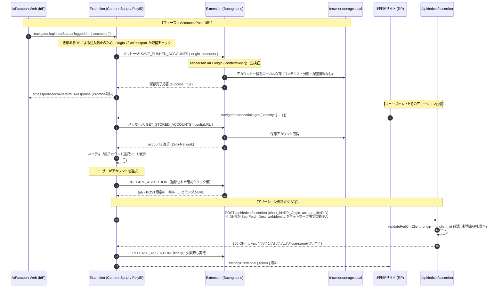

# Step 2 設計仕様書: 拡張機能ローカルストレージ連携・サーバーAssertion検証緩和

## 1. 概要と目的

Step 1 では、Webフロントエンドにおける W3C **IdP Registration API**（`IdentityProvider.register` / `unregister`）および **Accounts Push**（`navigator.login.setStatus('logged-in', { accounts })`）のUIと同期基盤を実装しました。

**Step 2** の目的は以下の2点です：
1. **サーバー側のAssertion検証緩和（IdP Registrationモデル対応）**:
   未登録の任意のサードパーティRP（Webサイト）からFedCMアサーション要求があった場合でも、`origin === client_id` かつ 有効なHTTPSオリジンであれば、公開情報である Handle Assist トークン（`{ v: 1, did, username }`）を発行できるよう検証ルールを緩和する。
2. **Firefox拡張機能側のストレージ連携 & 正規アサーション統合**:
   - WebフロントエンドでPushされたアカウント情報を Firefox拡張機能の `browser.storage.local` に安全に保持する。
   - RP側でアカウント選択時、拡張機能内でローカル生成していたモックトークンを撤廃し、Step 0 で検証済みの `declarativeNetRequest`（`Sec-Fetch-Dest: webidentity` 自動付与）経由で、正規のサーバーエンドポイント **`/api/fedcm/assertion`** を呼び出してトークンを取得・返却する。

---

## 2. 変更対象と全体アーキテクチャ



---

## 3. 詳細設計

### 3.1 サーバー側: Assertion検証の緩和 (`packages/frontend`)

#### 現状の課題
[`packages/frontend/src/lib/fedcm.ts`](file:///Users/usounds/Program/AtPassport/packages/frontend/src/lib/fedcm.ts) の `validateFedCmClient` は、116行目で `return registration ? { origin, registration } : null;` となっており、「データベースの `verified_domains`（ドメイン所有権確認済みテーブル）に事前登録されたドメイン」または「自ドメイン/開発localhost」のみを許可し、それ以外は `null`（403 Forbidden）を返しています。

#### 緩和ルール（IdP Registration モデル準拠）
W3C IdP Registration 仕様では、ユーザーがブラウザにIdPを登録した場合、世界中のあらゆる未登録RPからFedCMを利用できます。
AtPassportが発行するトークンは、認証チケットや秘密情報ではなく、公開情報であるDIDとハンドル名（`{ v: 1, did, username }`）に過ぎません（本人の認証は後続の atproto OAuth が担保）。

そのため、以下の条件を満たす場合は未登録RPであってもリクエストを承認します：

1. **`originHeader === clientId` の完全一致**:
   ブラウザが改ざん不能なHTTPヘッダーとして付与する `Origin` と、POSTボディの `client_id` が完全に一致していること（クロスオリジンのなりすまし防止）。
2. **正当なHTTPSオリジンであること**:
   `normalizeClientOrigin` を通過する正規のHTTPS URL（またはローカル開発環境のループバックHTTP）であること。
3. **戻り値の変更**:
   未登録RPの場合、`registration: null` としてクライアント情報を返す：
   ```typescript
   export async function validateFedCmClient(
     originHeader: string | null,
     clientId: string | null,
   ): Promise<{ origin: string; registration: VerifiedDomain | null } | null> {
     const origin = normalizeClientOrigin(originHeader);
     const normalizedClientId = normalizeClientOrigin(clientId);
     if (!origin || !normalizedClientId || origin !== normalizedClientId) {
       return null;
     }

     if (origin === "https://atpassport.net") {
       return { origin, registration: null };
     }

     const { hostname } = new URL(origin);
     const isLoopback =
       hostname === "localhost" ||
       hostname === "127.0.0.1" ||
       hostname === "[::1]" ||
       hostname.endsWith(".localhost");
     if (isLoopback && process.env.NODE_ENV !== "production") {
       return { origin, registration: null };
     }

     // 認証済みドメイン情報を取得（存在すれば紐付け、存在しなくても有効なHTTPSオリジンなら許可）
     const registration = await getFedCmClientRegistration(origin);
     return { origin, registration };
   }
   ```
4. **CORS プリフライト（OPTIONS）ハンドラーの追加**:
   サードパーティRP（Content Script）から `credentials: 'include'` 付きでクロスオリジンfetchを行う場合、ブラウザは必ずプリフライト `OPTIONS` リクエストを送信します。
   [`packages/frontend/src/app/api/fedcm/assertion/route.ts`](file:///Users/usounds/Program/AtPassport/packages/frontend/src/app/api/fedcm/assertion/route.ts) に `OPTIONS` ハンドラーを追加し、200 OK と適切なCORSヘッダーを返却します：
   ```typescript
   export async function OPTIONS(request: Request) {
     const origin = request.headers.get("origin");
     const normalizedOrigin = normalizeClientOrigin(origin);
     if (!normalizedOrigin) {
       return new Response(null, { status: 400 });
     }
     return new Response(null, {
       status: 200,
       headers: {
         ...fedCmCorsHeaders(normalizedOrigin),
         "Access-Control-Allow-Methods": "POST, OPTIONS",
         "Access-Control-Allow-Headers": "Content-Type",
         "Access-Control-Max-Age": "86400",
       },
     });
   }
   ```
5. **影響範囲**:
   - `/api/fedcm/assertion`: 未登録RPでも 200 OK で Handle Assist トークンが取得可能になる。
   - `/api/fedcm/client_metadata`: 認証済みドメインのみブランディング（利用規約・プライバシーポリシーURL）を返し、未登録ドメインには空のメタデータを返す（既存挙動を維持）。

---

### 3.2 Firefox拡張機能: ローカルストレージ連携 (`packages/atpassport-extension`)

#### 1. 権限追加 (`wxt.config.ts`)
拡張機能の `manifest.json` に `"storage"` 権限を追加します。
```typescript
permissions: [
  'cookies', // Firefoxでtab.cookieStoreIdを取得するため
  'activeTab',
  'storage',
  // firefox only
  ...(process.env.TARGET_BROWSER === 'firefox' ? ['declarativeNetRequest'] : [])
]
```

#### 2. ストレージ管理モジュール (`src/lib/accountStorage.ts`)
保存するアカウントスキーマを定義し、CRUDヘルパーを提供します：

```typescript
export interface StoredAccount {
  id: string; // did:plc:...
  name: string; // 表示名 または ハンドル
  username: string; // @handle.bsky.social
  picture?: string; // アバター画像URL
}

export interface StoredIdpEntry {
  origin: string; // e.g. "https://atpassport.net"
  accounts: StoredAccount[];
  updatedAt: number;
}

export const STORAGE_KEY_PREFIX = 'fedcm_idp_accounts:';
```
- **秘密情報の非保持**: Cookie値、セッションJWT、OAuthトークン等は一切ストレージに保存しない。公開アカウント情報のみを保持。
- **コンテキストおよびオリジン分離**: 送信元タブのコンテキスト（`cookieStoreId`）および IdPのオリジンを組み合わせたキー（`${STORAGE_KEY_PREFIX}${contextKey}:${normalizedOrigin}`）ごとに分離して保存。Firefoxのマルチアカウントコンテナ（仕事用・個人用等）間の候補混在を防止する。またプライベートブラウジング環境（`incognito`）では、永続ストレージへの書き込みを拒否し、取得時も空配列を返して漏洩を防ぐ。
- **ログアウト・失効連動**: `accounts` が空配列または `logged-out` の場合、対象コンテキスト・オリジンのエントリを安全に削除。さらにアサーション照会で 401 Unauthorized が返された場合も、対象コンテキストの一覧を即座に失効（クリア）させる。

#### 3. Main World での `navigator.login.setStatus` インターセプトとストレージ保存完了保証
`fedcm.content.ts`（Main Worldに注入されるインラインPolyfill）において：
- `navigator.login` が存在しない場合は初期化し、`setStatus` をラップ：
  ```javascript
  if (!navigator.login) {
    navigator.login = {};
  }
  var origSetStatus = navigator.login.setStatus ? navigator.login.setStatus.bind(navigator.login) : null;
  navigator.login.setStatus = function(status, options) {
    var requestId = 'status_' + Math.random().toString(36).slice(2) + Date.now();
    var savePromise = new Promise(function(resolve, reject) {
      var timeoutId = setTimeout(function() {
        window.removeEventListener('atpassport-fedcm-setstatus-response', responseHandler);
        reject(new Error('Account storage acknowledgement timed out'));
      }, 3000);

      var responseHandler = function(e) {
        try {
          var raw = e.detail;
          var data = typeof raw === 'string' ? JSON.parse(raw) : raw;
          if (data && data.requestId === requestId) {
            clearTimeout(timeoutId);
            window.removeEventListener('atpassport-fedcm-setstatus-response', responseHandler);
            if (data.success) {
              resolve();
            } else {
              reject(new Error(data.error || 'Failed to save pushed accounts in extension'));
            }
          }
        } catch (err) {}
      };

      window.addEventListener('atpassport-fedcm-setstatus-response', responseHandler);

      try {
        window.dispatchEvent(new CustomEvent('atpassport-fedcm-setstatus', {
          detail: JSON.stringify({ requestId: requestId, status: status, options: options })
        }));
      } catch (dispatchErr) {
        clearTimeout(timeoutId);
        window.removeEventListener('atpassport-fedcm-setstatus-response', responseHandler);
        reject(new Error('Failed to dispatch account storage request'));
      }
    });

    return savePromise.then(function() {
      if (origSetStatus) {
        try {
          return origSetStatus(status, options);
        } catch (e) {
          return Promise.resolve();
        }
      }
      return Promise.resolve();
    });
  };
  ```
- **セキュリティ要件（偽アカウント注入攻撃の防止）**:
  `fedcm.content.ts` は `<all_urls>` で動作するため、悪意ある第三者サイトが `atpassport-fedcm-setstatus` イベントを偽装してユーザーの拡張ストレージを汚染するリスクがあります。
  - **Content Script側の検証**: イベント受信時、`isAtPassportDomain(window.location.hostname)` を確認し、AtPassportドメイン（`atpassport.net`、`*.atpassport.net`、開発用 `localhost` 等）以外のページからのPushイベントは **即座に破棄** しエラー応答を返す。
  - **Background Script側の検証**: メッセージ受信時、`sender.tab?.url` または `sender.origin` が正当なAtPassportオリジンであることを二重検証する。さらにプライベートブラウジングタブからの保存要求は拒絶する。

---

### 3.3 Firefox拡張機能: サーバーAssertion連携

#### 現状の課題
現在 `packages/atpassport-extension/src/entrypoints/fedcm.content.ts` の `showFedCmPrompt` は、ユーザーがアカウントを選択した際、JavaScript内でローカルに以下を組み立てて返しています：
```javascript
const fakeToken = JSON.stringify({
  v: 1,
  did: selectedAccount.id,
  username: selectedAccount.name
});
resolve({ token: fakeToken });
```
これは完全なローカルモックであり、サーバーとの整合性検証（セッションや関連付けの存在確認）が行われていませんでした。

#### 正規エンドポイント `/api/fedcm/assertion` への接続
旧ルール1001による全リクエストへの注入は撤去する。起動時に旧dynamic ruleと残存する専用session ruleを削除し、ユーザーの信頼された確認クリック後に限り `PREPARE_ASSERTION` を送る。

backgroundはruntime senderのトップフレーム・タブ・Origin・コンテキストを確認し、推測困難な `extension_request` 付きURLを発行する。DNR session ruleはそのURLの完全一致・対象tabId・POSTだけを許可する。URLは拡張のisolated world内で扱い、ページイベントやログへ出さない。Content Scriptが10秒タイムアウト・リダイレクト拒否でfetchし、finallyで `RELEASE_ASSERTION` を送る。放置されたルールも15秒で削除する。これはセッション認証を代替せず、サーバーのOrigin/client_id・Cookie・関連付け検証は維持する。

新経路のFirefox実機検証は別途必要であり、旧Step 0の検証結果をそのまま流用しない。

一覧取得の制約：保存一覧が空でも、プライベート・非標準コンテナ・コンテキスト不明のタブではbackgroundのCookie付き一覧fetchへ戻らない。再訪によるPushが必要な失敗として扱う。標準コンテナの従来互換経路だけが `/api/user/handles` を使用する。コンテキスト不明の旧保存エントリは再利用しない。`cookies`権限のない状態を標準コンテナと仮定しない。

アカウント選択時の処理フロー：
1. ユーザーがポップアップでアカウントを選択し、信頼された確認クリックを行う。合成クリックではAssertionを開始しない。
2. 対象IdPの `id_assertion_endpoint`（例: `${idpOrigin}/api/fedcm/assertion`）に対して Content Script から `fetch` を実行：
   ```typescript
   const formData = new URLSearchParams();
   formData.append('client_id', window.location.origin);
   formData.append('account_id', selectedAccount.id);

   // PREPARE_ASSERTIONが返したランダムURLに対してのみ実行する。
   const response = await fetch(grant.assertionUrl, {
     method: 'POST',
     headers: {
       'Content-Type': 'application/x-www-form-urlencoded',
     },
     body: formData.toString(),
     credentials: 'include', // 要求元タブのコンテキストを維持
     redirect: 'error',
     signal: AbortSignal.timeout(10000),
   });
   ```
3. **実行コンテキストに関する考慮とCSPハンドリング**:
   - Content Script から実行することで、HTTP `Origin` ヘッダーが正しく RP ドメイン（`window.location.origin`）となり、サーバー側の `origin === client_id` 検証に合格します。
   - もしRPが非常に厳格な `Content-Security-Policy: connect-src` を設定している場合、ブラウザによって `atpassport.net` へのfetchがブロックされる可能性があります。その場合、fetchは例外（TypeError）となるため、Polyfill側で適切にキャッチし、RP側の既存Webリダイレクトフォールバックへ委ねる（動作を破壊しない）。
4. **サーバー応答の検証**:
   - `200 OK`: レスポンスの `{ token }` を取り出し、`IdentityCredential` オブジェクトとして RP の `navigator.credentials.get` Promise を解決。
   - `401 Unauthorized`: サーバー側でセッション失効またはアカウント不一致と判定された場合、偽のトークンは発行せず、対象コンテキストのローカル保存済みアカウント一覧を失効（`CLEAR_STORED_ACCOUNTS` メッセージを送信）させ、`IdentityCredentialError` をスローしてRP側のフォールバック処理に委ねる。
   - `403 Forbidden` / 5xx / 通信エラー: 一時的な通信障害等では保存済み一覧を保持し、適切な例外（`NetworkError`）をスローしてRP側のフォールバック処理に委ねる。

---

## 4. 変更ファイル一覧

| パッケージ | ファイルパス | 変更区分 | 内容 |
|---|---|---|---|
| `frontend` | `src/lib/fedcm.ts` | 変更 | `validateFedCmClient` を改修し、`origin === client_id` かつ 有効HTTPSオリジンであれば未登録RPでも承認。`isFedCmRequest` で `Sec-Fetch-Dest === "webidentity"` のみを厳格検証（ヘッダー迂回撤廃） |
| `frontend` | `src/app/api/fedcm/assertion/route.ts` | 変更 | `OPTIONS` CORSプリフライトハンドラーを追加 |
| `frontend` | `src/lib/__tests__/fedcm.test.ts` | 変更 | 未登録RPでの検証承認および `x-atpassport-fedcm` 除外テストケースを追加 |
| `frontend` | `src/app/api/fedcm/assertion/__tests__/route.test.ts` | 変更 | 未登録RPに対するアサーション成功およびOPTIONSプリフライトのテストケースを追加 |
| `atpassport-extension` | `wxt.config.ts` | 変更 | permissions に `"storage"`, `"cookies"` (firefox) を追加 |
| `atpassport-extension` | `src/lib/accountStorage.ts` | 新規 | `browser.storage.local` を用いたアカウント保存・取得・削除ヘルパー（コンテキストキー `cookieStoreId` 分離、プライベート保護） |
| `atpassport-extension` | `src/lib/__tests__/accountStorage.test.ts` | 新規 | ストレージ管理ヘルパーの単体テスト（コンテナ分離・レガシー除外含む） |
| `atpassport-extension` | `src/lib/backgroundMessages.ts` | 新規 | `SAVE_PUSHED_ACCOUNTS`, `GET_STORED_ACCOUNTS`, `CLEAR_STORED_ACCOUNTS`, `PREPARE_ASSERTION`, `RELEASE_ASSERTION` ハンドラー（送信者Origin・コンテキスト二重検証） |
| `atpassport-extension` | `src/lib/__tests__/backgroundMessages.test.ts` | 新規 | バックグラウンドメッセージ処理の単体テスト |
| `atpassport-extension` | `src/lib/fedcmHeaderRule.ts` | 新規 | 選択スコープ限定の一時的DNRセッションルール管理（旧ルール1001撤廃、tabId・POST・UUID URL限定、15秒失効タイマー） |
| `atpassport-extension` | `src/lib/__tests__/fedcmHeaderRule.test.ts` | 新規 | DNRセッションルール生成・解放・失効・不正Origin拒絶のテスト |
| `atpassport-extension` | `src/entrypoints/background.ts` | 変更 | 起動時DNR旧ルール掃除および `handleBackgroundMessage` メッセージリスナー配線 |
| `atpassport-extension` | `src/entrypoints/fedcm.content.ts` | 変更 | ① `login.setStatus` インターセプトとオリジン検証・ACK完了保証付きPush同期<br/>② コンテキスト別ローカル保存アカウントの表示<br/>③ 信頼されたクリック（`e.isTrusted`）に基づく `PREPARE_ASSERTION` 経由の直接 `fetch` および 401 時の `CLEAR_STORED_ACCOUNTS` 連動 |
| `atpassport-extension` | `src/entrypoints/injected.ts` | 変更 | 外部注入ポリフィルでも同様のACK応答待機とタイムアウト処理を同期 |
| `atpassport-extension` | `src/lib/__tests__/push-ack.test.ts` | 新規 | `setStatus` の保存ACK待機・タイムアウト・エラー拒絶の単体テスト |

---

## 5. テスト計画

### 5.1 単体テスト (Vitest)
1. **サーバー側 `validateFedCmClient`**:
   - 未登録の HTTPS RP（例: `https://unregistered-rp.example`）で `origin === client_id` の場合に `{ origin, registration: null }` が返ること。
   - `origin !== client_id` のなりすまし要求で `null`（拒否）となること。
   - 不正なプロトコル（HTTP）や不正なフォーマットで拒否されること。
   - `x-atpassport-fedcm` 等の任意ヘッダーによる検証迂回が不可能であること。
2. **サーバー側 `/api/fedcm/assertion`**:
   - `OPTIONS` プリフライトに対して 200 OK と正規CORSヘッダーが返ること。
   - 未登録RPからのPOSTリクエストに対して、セッションとアカウントが一致していれば `200 OK` でトークンが返ること。
3. **拡張機能 `accountStorage` & `backgroundMessages`**:
   - アカウントの保存、取得、空配列によるログアウト削除がコンテキストキー（`cookieStoreId`）ごとに独立して正常に行われること。
   - プライベートブラウジングでの保存拒絶、取得時空配列返却による漏洩防止。
   - 送信元Originの二重検証による偽アカウント注入防止。
4. **拡張機能のAssertionセッション付与 & 401失効**:
   - 信頼された確認クリックによる `PREPARE_ASSERTION` のみ許可、合成クリックの拒絶。
   - 401応答時の対象コンテキスト保存アカウントの自動失効（`CLEAR_STORED_ACCOUNTS`）。

### 5.2 統合・E2Eテスト
1. **Frontend Vitest スイート**:
   - 全42テストスイート（304テスト）が通過すること。
2. **Extension Vitest スイート**:
   - 全8テストスイート（82テスト）が通過すること。
3. **ビルド検証**:
   - Next.js本番ビルド (`pnpm build`) および 拡張機能ビルド (`wxt build && wxt build -b firefox`) が警告/エラーなく完了すること。

---

## 6. 実装・検証ステータス

- [x] **サーバー側 Assertion 検証緩和**: `packages/frontend/src/lib/fedcm.ts` および `src/app/api/fedcm/assertion/route.ts` にて実装・テスト完了。
- [x] **拡張機能ローカルストレージ & コンテナ分離**: `packages/atpassport-extension/src/lib/accountStorage.ts` および `backgroundMessages.ts` にて実装・テスト完了。
- [x] **Accounts Push 保存ACK同期保証**: Main World Polyfill (`fedcm.content.ts` / `injected.ts`) にて `requestId` による応答待ちと3秒タイムアウト機構を実装・テスト完了。
- [x] **一時DNRセッションルールによる直接Assertion fetch**: `fedcmHeaderRule.ts` および `fedcm.content.ts` にて実装、401時の自動一覧失効（`CLEAR_STORED_ACCOUNTS`）を実装・テスト完了。
- [x] **全テスト・ビルド通過**: Frontend 304テスト / Extension 82テスト 100%パス、Next.js & Firefox拡張ビルド成功。
- **次のステップ**: Step 3 (RP Client SDK registered IdP discovery `discovery: 'types'` およびフォールバック契約) への移行準備完了。

