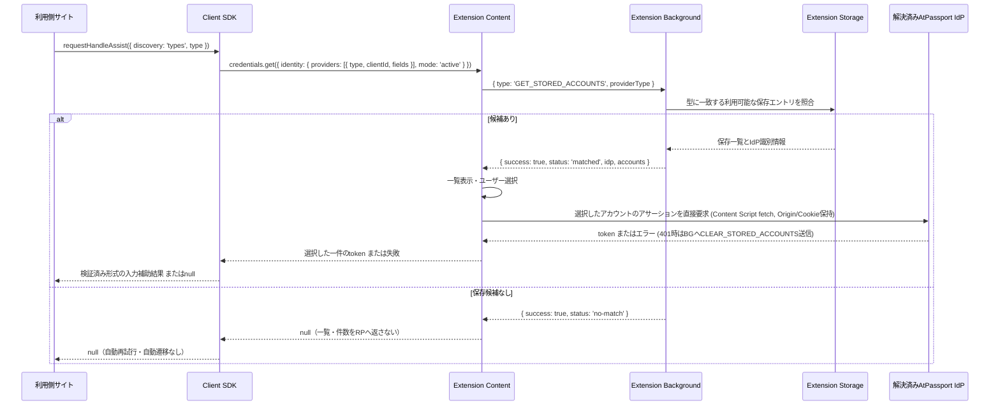

# Step 3 設計仕様書: RP側クライアントSDKの登録型IdP探索とフォールバック契約

## 1. 目的・対象仕様

2026-09-26レビュー反映。Step 0〜2で追加した通信・Push保存・サーバーAssertion連携を利用し、RP向けSDKと拡張機能へ登録型探索を明示的opt-inで追加する。本書は実装計画であり、ネイティブ互換性や実機E2Eの完了を示すものではない。

- RPの標準呼出しは `providers: [{ type: "https://atpassport.net" }]`。単数の `type` を使う。
- IdPのconfigには対応型の配列 `types: ["https://atpassport.net"]` を置く。RP側と混同しない。
- SDKの `discovery: 'types'` は探索モード名として維持するが、ブラウザへ `provider.types` を送らない。新しいSDKオプション名も `type?: string` とする。
- 通常FedCMは `configURL` 指定で、登録型探索は登録済みIdPとPush一覧から候補を探す。通常FedCMに登録操作を要求しない。
- 今回の拡張対応はAtPassportの検証済みOriginに限定する。typeは一般にはプロトコル識別子であり、URLのOriginをそのまま接続先と解釈しない。任意IdP対応は対象外。

参照仕様:
- [IdP Registration提案](https://github.com/w3c-fedid/idp-registration): RPの単数type、configのtypes、登録済み候補の照合。
- [FedCM仕様](https://w3c-fedid.github.io/FedCM/): active mode、ユーザー操作、キャンセルとエラー。

実装着手時に、採用する提案のコミットSHA・FedCM仕様の版・対象ブラウザのバージョンとフラグを記録する（現時点では未固定）。固定版が本書と異なる場合は、API・テストを更新してから着手する。

## 2. 全体シーケンス



ネイティブ経路はブラウザが探索・選択・Assertionを担当する。上図は拡張内部の契約であり、標準APIの返却形式を拡張しない。未対応時の切替は第3節による。

## 3. クライアントSDK

対象: `packages/atpassport-client/src/core.ts`、公開型・エクスポート、関連テスト。

### 3.1 オプションと互換性

```typescript
export interface HandleAssistOptions {
  targetInput?: HTMLInputElement;
  configURL?: string;
  clientId?: string;
  /** Registered-provider type. Defaults to https://atpassport.net. */
  type?: string;
  /** Defaults to config. types is the SDK mode name, not a Web API key. */
  discovery?: 'config' | 'types' | 'auto';
  fallback?: () => HandleAssistResult | null | Promise<HandleAssistResult | null>;
  onError?: (error: unknown) => void;
}
```

- デフォルトは必ず `'config'`。無指定で登録型探索を試さない。
- `configURL`、`clientId`の既定値、`context: 'use'`、`mode: 'active'`、`fields: ['username', 'picture']`、トークン検証・入力反映を維持する。
- `fallback` は同期・非同期の両方を維持する。SDK自身がURLを決めてリダイレクトしない。
- `AtPassportFedCmOptions` にも `type`・`discovery` を追加し、インスタンスの `requestHandleAssist()` から関数型APIへ転送する。既存の `baseUrl` とconfigURLの関係は維持する。
- `type` は非空のURL形式として事前検証する。不正値をブラウザ非対応と誤認して旧経路へ切り替えない。開発Originとtypeの対応は明示設定し、RPのOriginから推測しない。
- 登録型のproviderには `type`、`clientId`、`fields` を指定し、`configURL` は混在させない。configURLは旧経路用に保持する。

### 3.2 モード別契約

| モード | 最初の呼出し | 登録型未対応が確実な場合 | 候補なし・キャンセル・不明な失敗 |
| --- | --- | --- | --- |
| config（既定） | 従来のconfigURL | 該当なし | 既存の戻り値・fallback契約を維持 |
| types | 単数typeの登録型探索 | configへ再試行せず、設定済みfallbackを最大1回実行 | null。別UIを自動表示しない |
| auto | 単数typeの登録型探索 | configURLへ最大1回再試行 | null。別UIを自動表示しない |

新モードからconfigへ再試行した場合も、新モードの慎重なエラー分類を維持する。既存configモードの広いfallback処理をそのまま呼び出してキャンセル後の遷移を発生させない。

### 3.3 能力判定と失敗分類

- `IdentityCredential` の存在はベースラインFedCMの判定にのみ使う。登録型対応の証拠にしない。
- FedCM自体が存在しない環境では、設定済みfallbackを最大1回実行する。
- 登録型未対応を示す能力判定、または入力検証済みで対象版においてUI表示前の非対応と確認した `TypeError` / `NotSupportedError` に限り、上表の未対応分岐へ進む。例外名だけで全ブラウザを一律判定しない。
- ユーザー操作の有効期間内にconfig再試行が可能か、対象ブラウザで確認する。安全に再試行できない環境では自動再試行せず、RPの「別の方法で続ける」操作から従来経路を開始する。
- `AbortError`、`NotAllowedError`、nullは終了扱い。ポリフィルの明示的なユーザー取消しは `AbortError` とする。
- ネイティブでは閉じる操作も `NetworkError` になり得る。新モードでは `NetworkError` を通信障害と断定せず、自動config再試行・自動fallbackをしない。利用者が別経路を明示選択できるUIをRPに用意する。
- Assertionの401/403、削除済みDID、5xx、通信失敗、不正トークン、`IdentityCredentialError` は新モードでは終了扱い。エラーを成功に変えず、別経路で自動回避しない。
- エラー時は `onError` に通知してnullを返す。no-matchのnullは通常結果とし、内部の候補数・保存状態を公開しない。fallback自身の例外と戻り値は従来の契約を維持し、再帰的にfallbackしない。

既存configモードのNetworkError等に対するfallbackは互換性のため本Stepでは維持する。そのため「キャンセル後に自動遷移しない」という新保証はtypes/autoに適用し、既存モード全体が改善済みとは表記しない。既存モードの契約変更は別の互換性判断として扱う。

## 4. 拡張機能

対象:
- `src/entrypoints/fedcm.content.ts`（INLINE_POLYFILL_CODEおよびexecuteFedCmFlow）
- `src/entrypoints/injected.ts`
- `src/lib/backgroundMessages.ts`
- `src/lib/accountStorage.ts`
- `src/lib/fedcm-url.ts` と各テスト

### 4.1 インターセプトとprovider選択

両注入経路で `provider.type` の単数文字列を判定する。型識別子は検証済みの `https://atpassport.net` と開発設定のURLに限定し、非URLの `'atpassport'` 別名は導入しない。

`providers.some(...)` で捕捉した後に無条件で `providers[0]` を使わない。捕捉したproviderと探索モードを `executeFedCmFlow` へ引き渡す。SDKが送るproviderは1件とし、拡張で未対応の複数provider要求は部分的に処理せず、既存ネイティブへの委譲または明示的な非対応応答を行う。未知typeを既定AtPassportへ置換しない。

### 4.2 メッセージ契約とIdPの引継ぎ

`message.type` は既存の操作種別として維持し、探索型は `providerType` に分離する。

```typescript
// 登録型要求。旧config経路のorigin/configURL要求は引き続き別分岐で受け付ける。
{ type: 'GET_STORED_ACCOUNTS', providerType: 'https://atpassport.net' }

// 内部成功応答
{
  success: true,
  status: 'matched',
  idp: { origin: 'https://atpassport.net', configURL: 'https://atpassport.net/fedcm/config.json' },
  accounts: [/* 保存一覧 */]
}

// 一致なし。保存読出し失敗とは区別する。
{ success: true, status: 'no-match' }
```

backgroundは型に一致する保存エントリを解決して返す。contentはそのIdPと一覧・選択を同じ要求内で保持し、`EXECUTE_ASSERTION` のoriginへ引き継ぐ。typeからURLを組み立てたり、解決できなければ本番Originへ戻したりしない。

Assertionは解決済みの許可Originの正規エンドポイントへ送る。backgroundは送信者のRP情報とclientId、IdPの許可範囲を再確認する。要求元・選択・IdPを結び付け、別要求や遅延応答との取り違えを防ぐ。

### 4.3 保存と候補なし

- `StoredIdpEntry` に `configURL` と `types: string[]` を追加する。IdP configのtypesと拡張の許可設定の対応を検証し、保存・更新経路から一貫して書き込む。
- 開発用typeは開発エントリへ、本番typeは本番エントリへ対応させる。同じtypeに複数IdPが一致するケースは本Stepでは未対応として扱い、先頭や既定IdPを黙って選ばない。
- 旧スキーマには型情報がないため、config経路での読出しを維持し、登録型候補には含めない。IdP再訪時の検証済みPushでメタデータを付けて更新する。RP要求だけで登録済みへ昇格させない。
- 拡張利用者の自動連携方針は維持する。候補資格と解除状態はマスター計画に従い、保存一覧の存在だけで拒否・解除を上書きしない。
- 登録型では未登録・型不一致・Push未完了・空一覧をno-matchとして扱う。`FETCH_ACCOUNTS` へ暗黙に切り替えない。SDKのtypes/autoもno-matchを未対応と扱わない。
- 保存破損・読出し失敗はエラーとし、no-matchや旧ネットワーク経路に置換しない。
- 従来config経路では既存の `FETCH_ACCOUNTS` 互換動作を維持する。

### 4.4 通信の表現

「Zero-Network」は無条件の完了基準にしない。登録型の保存一覧表示ではaccounts APIを呼ばないことを検証し、config・画像・選択後Assertion通信を分けて計測する。標準提案のconfig取得を省く拡張のキャッシュ最適化は仕様との差分として記録する。

## 5. サンプルアプリ

対象: `packages/frontend/src/app/[locale]/example/ExampleAppClient.tsx`。

- config / types / autoの開発・検証用モード選択を追加する。
- 登録型の表示例は `type: https://atpassport.net` とする。開発環境では対応するtypeとfallback用configURLを明示的に揃える。
- 新モードのnullや不明な失敗で自動遷移しない。「別の方法で続ける」の明示操作で既存Web認証へ進める。
- 保存候補の有無を公開APIで照会する導線を追加しない。

## 6. テスト計画

### 6.1 SDK単体・型検査

- 無指定がconfigを1回だけ呼び、従来パラメータ・返却・入力反映を維持する。
- types/autoが単数 `provider.type` を送り、configURLやprovider.typesを混在させない。
- インスタンスAPIからも新オプションが転送される。
- 同期null・同期結果・Promiseを返すfallbackが型検査を通り、正しく実行される。
- 確認済みの未対応分岐で、typesはfallback、autoはconfig再試行を各最大1回実行する。
- 最初の呼出し・config再試行の両方について、AbortError / NotAllowedError / NetworkError / IdentityCredentialError / nullで新モードの自動fallbackが走らない。
- 不正type、サーバー拒否、不正tokenで再試行や入力反映をしない。従来configのfallback契約は別テストで維持する。

### 6.2 拡張の単体・統合

- 両注入経路が単数typeを捕捉し、未知type・未対応の複数providerを誤処理しない。
- 操作種別typeとproviderTypeが衝突せずbackgroundへ届く。
- 本番/開発それぞれで、要求type → 保存エントリ → 表示一覧 → AssertionのOriginが一致する。
- no-match・旧スキーマ・解除状態・空一覧・読出し失敗時に登録型がFETCH_ACCOUNTSを呼ばない。
- 保存更新がconfigURL/typesを維持し、旧config経路を壊さない。
- 401/403/5xx・通信失敗・削除済みDIDで成功tokenを生成せず、自動的に旧経路へ戻らない。

### 6.3 実機E2E

| 環境・条件 | 確認内容 |
| --- | --- |
| Firefox＋拡張、本番/開発 | 登録型表示から選択、正しいIdPへのAssertion、入力反映 |
| Firefox＋拡張、未Push/空一覧/解除/旧保存 | 自動ネットワーク取得・自動遷移なし。明示操作で従来経路が利用可能 |
| Firefox＋拡張、キャンセル/Assertion失敗 | 別UIの自動表示なし、入力変更なし |
| Chromeネイティブ、登録型対応の固定版 | 単数typeで探索、選択、閉じる/ESC、エラーの実際の結果 |
| Chromeネイティブ、登録型非対応の固定版 | 非対応の判定根拠、auto再試行とユーザー操作要件 |
| Safari/拡張なしFirefox | FedCM未対応時に設定済みfallbackを1回実行 |
| 各対応環境のconfig | オプション無変更の既存RPが従来動作を維持 |

Chrome登録型対応環境を用意できなければ未検証として記録し、ネイティブ互換性確認済みとは扱わない。通信はaccounts/config/画像/Assertionを分けて記録する。

## 7. 完了基準

- [ ] 仕様コミット・対象ブラウザ版・能力判定の根拠・拡張との差分を記録した。
- [ ] 単数typeのSDK・インスタンスAPI・両ポリフィル経路を実装した。
- [ ] 解決したIdPをAssertionまで維持し、本番/開発の取り違えを防いだ。
- [ ] no-matchとエラーを区別し、登録型の暗黙FETCH_ACCOUNTSを禁止した。
- [ ] 新モードのキャンセル・不明なNetworkError・サーバー拒否で自動遷移しない。
- [ ] 同期fallbackを含む既存config APIの互換性を維持した。
- [ ] 単体・型検査と実機検証を実施し、未検証環境を明記した。
- [ ] /exampleでモード選択と利用者の明示操作による別経路を確認した。
