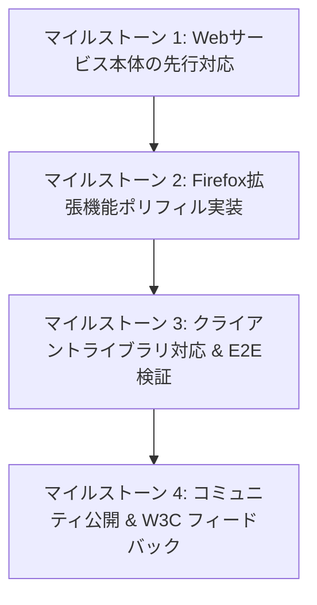

# FedCM IdP Registration & Accounts Push 対応実装計画

## 1. 目的と背景

### 1.1 課題と背景
現在の @passport では、W3C 標準である **FedCM (Federated Credential Management API)** を採用し、ブラウザネイティブなアカウント選択 UI を用いたハンドル入力アシストを実現している。
しかし、現行の FedCM 仕様（Chromium 141+ 準拠）には分散型プロトコル（atproto、IndieAuth、Fediverse 等）にとって以下の構造的課題が存在する：

1. **IdP の固定列挙（Enumeration）の強制**:
   - Relying Party（RP: 利用側 Web アプリ）は、呼び出し時に `providers: [{ configURL: 'https://atpassport.net/fedcm/config.json' }]` のように、IdP のエンドポイントをコード内にハードコードしなければならない。
   - Google や Apple のような数社の中央集権 IdP であれば列挙可能だが、各ユーザーが個別の PDS（Personal Data Server）や独自ドメインを持つ分散型エコシステムでは、RP が無数の IdP を事前にリストアップすることは不可能である。
2. **サードパーティ Cookie / 通信依存の残存**:
   - 現行の FedCM アカウント取得（`GET /api/fedcm/accounts`）は、RP ページを開いた際にブラウザが裏で IdP のセッション Cookie を付与して通信を行う。
   - 通信レイテンシが発生するほか、タイミング攻撃（Silent Timing Attack）によるログイン状態の推測リスクや、サードパーティ Cookie 規制との摩擦が残る。

### 1.2 次世代標準プロポーザル（w3c-fedid/idp-registration）
W3C Federated Identity Community Group (FedID CG) において、Google Chrome FedCM リード（Samuel Goto）や OAuth/IndieAuth 仕様策定者（Aaron Parecki）らによって **[IdP Registration API](https://github.com/w3c-fedid/idp-registration)**（Stage 1）が提案されている。

本プロポーザルは以下の 2 本の柱から構成される：
1. **IdP のブラウザ登録 (`IdentityProvider.register()`)**:
   - ユーザーが利用している IdP が、ブラウザに対して自らをログインプロバイダーとして登録する（`navigator.registerProtocolHandler` に近いモデル）。
2. **アカウントのブラウザ直接預託 (`Accounts Push`)**:
   - `navigator.login.setStatus("logged-in", { accounts: [...] })` により、IdP からブラウザ内部ストレージへ直接アカウント情報をプッシュ保存する。
3. **RP の型マッチング呼び出し**:
   - RP は特定の IdP URL を列挙せず、`providers: [{ type: "atproto" }]` や「任意の登録済み IdP」を指定して FedCM を呼び出す。

### 1.3 本計画のゴール
- **先行プロトタイプとしての Firefox 拡張機能ポリフィル実装**:
  - ブラウザ本体への標準搭載（Stage 1→標準化）を待つことなく、既存の `@atpassport-extension`（Firefox 拡張機能）を活用してこの次世代仕様を完全に動作するポリフィルとして実装・提供する。
- **@passport の「アグリゲーター型 IdP」としての適合**:
  - `atpassport.net` を `type: "atproto"` を宣言する登録型 IdP として適合させ、複数ハンドルの一括管理・提供価値を維持・発展させる。
- **完全な後方互換性の維持**:
  - 従来の `configURL` 直接指定による FedCM フローや、Web リダイレクトフローを一切壊すことなく、プログレッシブに次世代仕様を導入する。

---

## 2. 調査結果・技術分析

### 2.1 先行類似技術との比較

#### `loggedin.fyi`（pre-FedCM）
- **仕組み**:
  - サードパーティ Cookie（`loggedin_session`）+ Storage Access API + `<iframe>` (postMessage) を使用。
  - アプリ間で直近利用した DID とオリジンの履歴を共有キャッシュする。
- **課題**:
  - 各ブラウザで年々厳格化するサードパーティ Cookie 規制・ストレージアクセス権限要求の壁に直面する。
- **位置づけ**:
  - 本質的に `idp-registration` が目指す「分散型アプリ間でのアカウント共有」を、現行の Web プラットフォームの制約下（Cookie/iframe）で擬似的に実現しようとしたアプローチ（＝まさに "pre-FedCM"）。

#### 現行 FedCM (@passport)
- **仕組み**:
  - ブラウザネイティブの UI を使用するが、アカウント取得時は `atpassport.net/api/fedcm/accounts` へ Cookie 付きフェッチを行う。
  - RP は `atpassport.net` の URL を固定指定する。

#### 次世代 FedCM (IdP Registration + Accounts Push)
- **仕組み**:
  - アカウント一覧がブラウザ（または拡張機能）のローカルストレージ内に保持される。
  - アカウント選択時の外部ネットワーク通信はゼロ（0ms で即座にネイティブ UI 表示）。
  - クッキー規制の影響を完全に排除。

### 2.2 比較サマリー

| 比較項目 | 現行 @passport (FedCM) | loggedin.fyi (pre-FedCM) | 次世代 IdP Registration + Accounts Push |
| :--- | :--- | :--- | :--- |
| **アカウント保持場所** | @passport サーバー | loggedin.fyi サーバー | **ブラウザ / 拡張機能のローカル内部** |
| **RP 表示時の通信** | Cookie 付き HTTP 通信 (GET /accounts) | iframe / Storage Access API 通信 | **通信ゼロ（完全ローカル解決）** |
| **サードパーティ Cookie 依存** | あり（credentialed fetch） | あり（Storage Access 経由） | **完全排除（Cookie 不使用）** |
| **RP の IdP 指定** | `configURL` の固定記述 | 事前メタデータフェッチ | **`type: "atproto"` または「任意」** |
| **タイミング攻撃リスク** | わずかに残存 | 権限取得フローにより存在 | **完全解消（未選択時は通信なし）** |

---

## 3. アーキテクチャ設計

### 3.1 全体構造図

```text
┌─────────────────────────────────────────────────────────────────────────────┐
│ 1. IdP 登録 & Accounts Push（atpassport.net または 各 PDS にて実行）        │
│                                                                             │
│   atpassport.net ログイン時:                                                │
│    ├─ IdentityProvider.register("https://atpassport.net")                   │
│    └─ navigator.login.setStatus("logged-in", { accounts: [Alice, Sub, ...] })│
└──────────────────────────────────────┬──────────────────────────────────────┘
                                       │ 登録 & アカウント預託
                                       ▼
┌─────────────────────────────────────────────────────────────────────────────┐
│ 2. ブラウザ拡張機能ポリフィル / ブラウザ内部ストレージ                      │
│                                                                             │
│   browser.storage.local:                                                    │
│    ├─ registered_idps: [                                                    │
│    │    { url: "https://atpassport.net", types: ["atproto"], ... }          │
│    │  ]                                                                     │
│    └─ idp_accounts: {                                                       │
│         "https://atpassport.net": [ { id: "did:plc:...", name: "alice" } ] │
│       }                                                                     │
└──────────────────────────────────────▲──────────────────────────────────────┘
                                       │ 照合 & アカウント選択UI提示
                                       │ (通信ゼロ・ローカル描画)
┌──────────────────────────────────────┴──────────────────────────────────────┐
│ 3. RP（外部アプリ: Bluesky クライアント等）でのログイン呼び出し             │
│                                                                             │
│   navigator.credentials.get({                                               │
│     identity: {                                                             │
│       providers: [                                                          │
│         { type: "atproto" }, // 次世代: 登録済み atproto IdP を要求         │
│         { configURL: "https://atpassport.net/fedcm/config.json" } // フォールバック │
│       ]                                                                     │
│     }                                                                       │
│   })                                                                        │
└─────────────────────────────────────────────────────────────────────────────┘
```

---

## 4. 詳細仕様と実装方針

### 4.1 コンポーネント①: Web サービス本体 (`packages/frontend`)

#### A. `config.json` への `types` フィールド追加
- **ファイル**: `packages/frontend/src/app/fedcm/config.json/route.ts`
- **変更内容**: レスポンス JSON に `"types": ["atproto", "https://atproto.com"]` を追加。
```typescript
return NextResponse.json({
  accounts_endpoint: "/api/fedcm/accounts",
  client_metadata_endpoint: "/api/fedcm/client_metadata",
  id_assertion_endpoint: "/api/fedcm/assertion",
  login_url: "/en/fedcm/login",
  types: ["atproto", "https://atproto.com"], // ← 追加
  supports_use_other_account: true,
  branding: { ... }
});
```

#### B. セッション確立時の `register` および `Accounts Push` の発行
- **ファイル**: `packages/frontend/src/lib/fedcm-session-client.ts`
- **変更内容**:
  1. `window.IdentityProvider?.register` が存在する場合、`atpassport.net` を登録。
  2. `navigator.login?.setStatus` の呼び出し時、登録済みハンドル一覧を取得して `accounts` オブジェクト配列を渡す。
```typescript
// 1. IdP 登録（未登録の場合）
if (typeof window !== 'undefined' && 'IdentityProvider' in window) {
  try {
    await (window as any).IdentityProvider.register(window.location.origin);
  } catch (e) {
    console.debug('IdentityProvider.register failed or denied', e);
  }
}

// 2. Accounts Push
if (typeof navigator !== 'undefined' && 'login' in navigator) {
  const accountsData = userHandles.map(h => ({
    id: h.did,
    name: h.handle,
    email: h.handle,
    picture: h.avatarUrl || undefined,
  }));
  
  await (navigator as any).login.setStatus('logged-in', {
    accounts: accountsData
  });
}
```

---

### 4.2 コンポーネント②: ブラウザ拡張機能 (`packages/atpassport-extension`)

Firefox および Chrome 向けの拡張機能として、仕様を先取りした **ポリフィル＆ランタイム** を構築する。

#### A. Main World スクリプト注入 (`injected.ts`)
- **`window.IdentityProvider` の定義**:
  - `register(idpUrl: string): Promise<void>`
  - `unregister(idpUrl: string): Promise<void>`
  - 呼び出されたら CustomEvent / postMessage 経由で content script → background script へ中継。
- **`navigator.login.setStatus` の拡張**:
  - 第 2 引数 `{ accounts: [...] }` を受け取れるように monkey-patch し、バックグラウンドストレージへ通知。
- **`navigator.credentials.get` のマッチング拡張**:
  - `options.identity.providers` 内の `{ type: "..." }` を解析。
  - 登録済み IdP の `types` と照合し、合致するアカウント群を抽出。

#### B. バックグラウンドストレージ管理 (`background.ts`)
- `browser.storage.local` に以下を保持：
  - `registered_idps`: `Map<Origin, { configURL, types, branding, registeredAt }>`
  - `pushed_accounts`: `Map<Origin, Account[]>`
- `IdentityProvider.register(url)` 受信時：
  - バックグラウンド側で `url + "/.well-known/web-identity"` および `config.json` を安全にフェッチ・検証。
  - （必要に応じて）拡張機能の通知や確認ダイアログで「このプロバイダーを追加しますか？」を確認。

#### C. アカウント選択 UI（Shadow DOM Prompt Card）
- すでに Firefox 向けに実装されている Shadow DOM プロンプトカードを拡張：
  - 複数 IdP から集約されたアカウントがある場合、提供元 IdP（@passport または各 PDS）のバッジやアイコンを付与して表示。
  - アカウント選択時、そのアカウントを発行した IdP の `id_assertion_endpoint` にのみ最終的な Assertion を要求。

---

### 4.3 コンポーネント③: クライアントライブラリ (`packages/atpassport-client`)

外部アプリ開発者が極めてシンプルなコードで次世代 FedCM を利用できるようにする。

#### A. `providers` 指定の柔軟化
```typescript
// @atpassport/client 内部の navigator.credentials.get 呼び出し
const providers: IdentityProviderConfig[] = [];

// 次世代対応: atproto 型 IdP の自動探索
providers.push({
  type: "atproto",
} as any);

// フォールバック: @passport 直接指定
providers.push({
  configURL: `${this.config.endpoint || 'https://atpassport.net'}/fedcm/config.json`,
  clientId: this.config.clientId,
});

const credential = await navigator.credentials.get({
  identity: {
    providers,
    mode: 'button',
  }
});
```

---

## 5. 段階的導入ステップ（マイルストーン）



### マイルストーン 1: Web サービス本体の先行対応（packages/frontend）
- [ ] `packages/frontend/src/app/fedcm/config.json/route.ts` に `"types": ["atproto"]` を追加。
- [ ] `packages/frontend/src/lib/fedcm-session-client.ts` で、セッション準備完了時に Accounts Push 引数を付与する処理を追加（API が存在する場合のみ実行する防御的実装）。
- [ ] 単体テスト・既存 FedCM エンドポイントテストのパス確認。

### マイルストーン 2: Firefox 拡張機能ポリフィル実装（packages/atpassport-extension）
- [ ] `injected.ts` に `window.IdentityProvider = { register, unregister }` を追加。
- [ ] `injected.ts` の `navigator.login.setStatus` パッチに Accounts Push 引数のハンドリングを追加。
- [ ] バックグラウンドストレージに登録済み IdP およびプッシュ済みアカウントの保存ロジックを実装。
- [ ] `navigator.credentials.get` のハンドラーを改修し、`providers: [{ type: "atproto" }]` によるローカルアカウント照合を実装。
- [ ] Firefox 上でのモック IdP 登録・選択動作確認。

### マイルストーン 3: クライアントライブラリ対応 & E2E 検証
- [ ] `@atpassport/client` の `requestHandleAssist()` で、次世代プロバイダー指定（`type: "atproto"`）をサポート。
- [ ] サンプルアプリ（`packages/frontend/src/app/[locale]/example`）において、ローカル通信ゼロでの高速アカウント選択の E2E 検証。

### マイルストーン 4: コミュニティ公開 & W3C フィードバック
- [ ] GitHub リポジトリ（`w3c-fedid/idp-registration`）の Discussions / Issues にて、atproto / @passport による本拡張機能ポリフィルの動作デモおよび実装知見をフィードバック。

---

## 6. セキュリティとプライバシーの考慮事項

1. **悪意ある IdP のなりすまし防止**:
   - `IdentityProvider.register(url)` で渡された URL について、拡張機能バックグラウンドで必ずオリジン検証（HTTPS、有効な `.well-known/web-identity`）を実施する。
2. **Accounts Push のスコープ制限**:
   - ある IdP が `navigator.login.setStatus` でプッシュできるアカウントは、自オリジンの権限範囲（DID / ハンドル）に限定する。
3. **RP への情報漏洩防止**:
   - ユーザーがプロンプト上でアカウントをクリックして選択を確定するまで、RP 側スクリプトにはいかなる情報（アカウント数、DID、IdP オリジン等）も渡さない。
4. **完全なフォールバック保証**:
   - ポリフィル拡張機能がインストールされていない環境、または FedCM 自体に未対応のブラウザでは、従来の Web リダイレクト認証フローへ自動的に安全フォールバックする。
